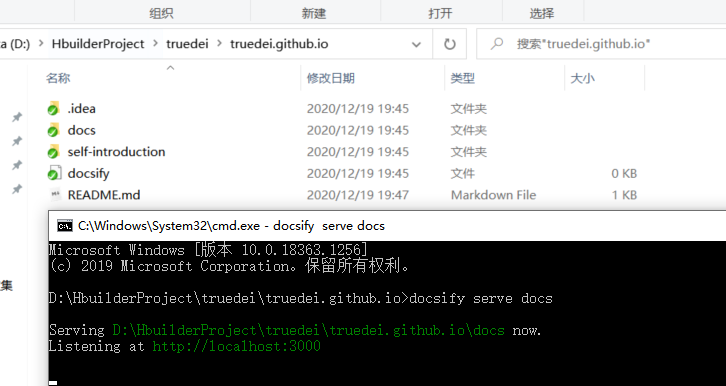

# 如何启动此项目

> 还在加班加点的写着,可以点中文查看.


windows：
1、打开cmd命令行

2、进入到此项目的根目录

3、使用`docsify serve docs`进行启动


出现下图所示的即启动成功：




环境部署与搭建：
在使用npm过程中经常会遇到无法下载包的问题，本人在这里整理了几个npm使用国内镜像加速的方法，希望对大家有所帮助。

一、修改成淘宝镜像源
1. 命令

npm config set registry https://registry.npm.taobao.org

2. 验证命令

npm config get registry

如果返回https://registry.npm.taobao.org，说明镜像配置成功。

二、修改成华为云镜像源
1. 命令

npm config set registry https://mirrors.huaweicloud.com/repository/npm/

2. 验证命令

npm config get registry

如果返回https://mirrors.huaweicloud.com/repository/npm/，说明镜像配置成功。

三、通过使用淘宝cnpm安装
1. 安装cnpm

npm install -g cnpm --registry=https://registry.npm.taobao.org

2. 使用cnpm

cnpm install xxx


环境部署：
首先查看你的本地命令行中是否安装了 Docsify。

运行 docsify -v

如果显示：


```shell
C:\WorkDir\Repository\cwiki-us-docs\spring-boot-docs>docsify -v
'docsify' is not recognized as an internal or external command,
operable program or batch file.
```

就说明你的系统中没有安装。

如果你已经装了 npm 或者 python 的话，

运行命令：

npm i docsify-cli -g
进行安装。

计算机将会输出：

```shell
C:\WorkDir\Repository\cwiki-us-docs\spring-boot-docs>npm i docsify-cli -g
C:\Users\yhu\AppData\Roaming\npm\docsify -> C:\Users\yhu\AppData\Roaming\npm\node_modules\docsify-cli\bin\docsify

> docsify@4.11.6 postinstall C:\Users\yhu\AppData\Roaming\npm\node_modules\docsify-cli\node_modules\docsify
> opencollective-postinstall

Thank you for using docsify!
If you rely on this package, please consider supporting our open collective:
> https://opencollective.com/docsify/donate

npm WARN optional SKIPPING OPTIONAL DEPENDENCY: fsevents@~2.1.2 (node_modules\docsify-cli\node_modules\chokidar\node_modules\fsevents):
npm WARN notsup SKIPPING OPTIONAL DEPENDENCY: Unsupported platform for fsevents@2.1.3: wanted {"os":"darwin","arch":"any"} (current: {"os":"win32","arch":"x64"})

+ docsify-cli@4.4.1
added 204 packages from 90 contributors in 16.035s
```

再次运行命令查看版本。

如果能够显示版本号的话，就说明已经安装成功了。

```shell
C:\WorkDir\Repository\cwiki-us-docs\spring-boot-docs>docsify -v

docsify-cli version:
  4.4.1

```