# SpringBoot集成shrio安全框架


项目地址：
https://github.com/8042965/springboot-shiro.git


# 一、环境

我的环境：

jdk1.8

MySql5.7

IDEA

Maven 3.5


# 二、Shiro介绍


介绍


# 三、创建SpringBoot项目


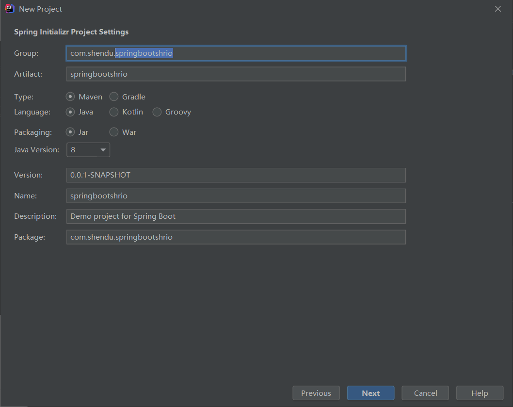


什么都不需要选，一会需要什么我们再添加什么，不然直接都添加上会很晕的。

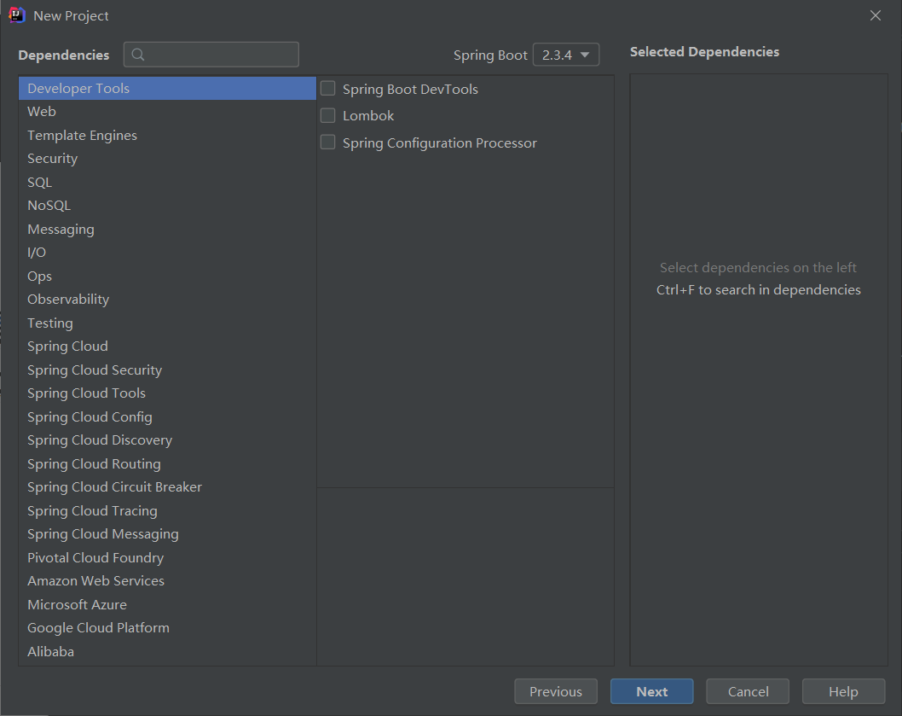


存放的位置


创建好的项目结构：

> 可以把cmd什么的给删除。没有什么用，下图中就是已经把没用的文件给删除之后的。


创建必要的包：

> 这里注意了，为了规范，我们事先建好bean、config、controller、dao、service、service.impl包，并且把启动类给放到com包下。


**测试SpringBoot项目是否可以启动成功并且访问成功：**


1、新增springboot的web依赖

```xml
<!--        SpringBoot支持web的依赖-->
        <dependency>
            <groupId>org.springframework.boot</groupId>
            <artifactId>spring-boot-starter-web</artifactId>
        </dependency>
```


注意：

`每一次新增pom文件中的坐标就一定要点maven这个窗口的刷新，不然就无法被直接加载进来的：`

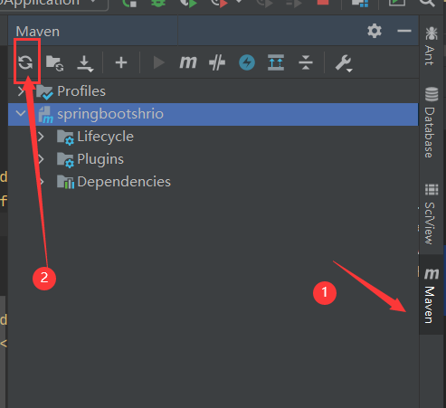


2、在com.shendu.springbootshiro.controller下创建TestController类，内容如下：

```java
/**
 * @program: springbootshrio
 * @description:
 * @author: zhengh
 * @create: 2020-10-25 19:15
 **/
@Controller
public class TestController {

    @GetMapping("/test")
    @ResponseBody
    public String test(){
        return "test ok";
    }

}
```


3、启动


**注意：**

如果显示红×了，可以点击edit:

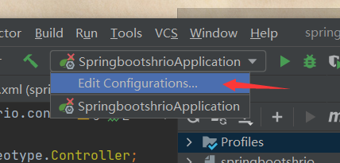

然后把路径修改对即可


当出现下图就成功了：

> 可以看到启动的端口为8080，记住了，要用到的


测试test接口是否可访问成功：


如果您没出现这个图，请不要继续了，请检查是否遗漏步骤！！！

# 四、SpringBoot集成thymeleaf

为了方便我们测试，我们直接写html就可以了，不用jsp，所以需要集成一下thymeleaf模板引擎。


1、pom文件引入thymeleaf的依赖：

```xml
<!--        支持html的依赖 thymeleaf-->
        <dependency>
            <groupId>org.springframework.boot</groupId>
            <artifactId>spring-boot-starter-thymeleaf</artifactId>
        </dependency>
```


2、在resources目录下创建templates目录，然后创建index.html文件

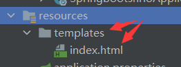

页面内容如下：

```html
<!DOCTYPE html>
<html lang="en" xmlns:th="http://www.thymeleaf.org">
<head>
    <meta charset="UTF-8">
    <title>深度工作室</title>
</head>
<body>

<h1>欢迎：</h1>
<h2 th:text="${name}"></h2>

<hr/>

</body>
</html>
```


3、创建IndexController类：

```java
/**
 * @program: springbootshrio
 * @description:
 * @author: zhengh
 * @create: 2020-10-25 19:29
 **/
@Controller
public class IndexController {

    @GetMapping("/index")
    public String index(String name,Model model){

        model.addAttribute("name",msg==null?"深度工作室！":msg);

        return "index";
    }

}
```


4、测试

> 出现下面这个可以访问到的html就算集成成功了


`如果测试不成功，也不要继续往下看哦！因为会用到的。`


5、继续创建几个页面方便我们测试权限过滤等功能

目录结构如下：


add.html:

```html
<!DOCTYPE html>
<html lang="en">
<head>
    <meta charset="UTF-8">
    <title>Title</title>
</head>
<body>
新增用户信息
</body>
</html>
```


update.html:

```html
<!DOCTYPE html>
<html lang="en">
<head>
    <meta charset="UTF-8">
    <title>Title</title>
</head>
<body>
更新用户信息
</body>
</html>
```


login.html:

```html
<!DOCTYPE html>
<html lang="en" xmlns:th="http://www.thymeleaf.org">
<head>
    <meta charset="UTF-8">
    <title>Title</title>
</head>
<body>
<h1>登录页面</h1>
<h3 >提示：</h3>
<h4 style="color: red" th:text="${msg}"></h4>

<form method="post" action="/login">
    用户名：<input type="text" name="name"/> <br/>
    密码：<input type="password" name="password"/> <br/>
    <input type="submit" value="登录">
</form>


</body>
</html>
```


6、创建几个页面的Controller类


AddController.java:

```java

/**
 * @program: springboot-shiro
 * @description:
 * @author: zhengh
 * @create: 2020-10-25 17:19
 **/

@Controller
public class AddController {

    @RequestMapping("/add")
    public String add(){
        return "user/add";
    }

}
```


LoginController.java:

```java
/**
 * @program: springboot-shiro
 * @description:
 * @author: zhengh
 * @create: 2020-10-25 17:33
 **/
@Controller
public class LoginController {

    @RequestMapping("/user/login")
    public String index(){
        return "user/login";
    }

}
```


UpdateController.java:

```java

/**
 * @program: springboot-shiro
 * @description:
 * @author: zhengh
 * @create: 2020-10-25 17:19
 **/
@Controller
public class UpdateController {
    @RequestMapping("/update")
    public String add(){
        return "user/update";
    }
}

```


7、修改index.html

> 添加相应的链接方便我们测试


```html
<!DOCTYPE html>
<html lang="en" xmlns:th="http://www.thymeleaf.org">
<head>
    <meta charset="UTF-8">
    <title>深度工作室</title>
</head>
<body>

<h1>欢迎：</h1>
<h2 th:text="${name}"></h2>

<hr/>

<a href="/add">添加用户</a> |
<a href="/update">修改用户</a>

</body>
</html>
```


8、测试：

> 如果点击之后不能访问，那么请继续返回检查自己是否遗漏某个地方

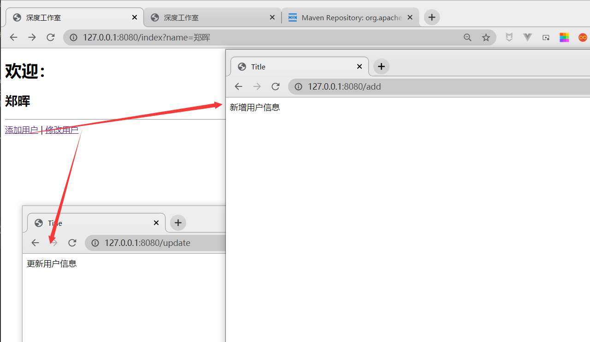


# 五、SpringBoot集成Shiro


## （一）pom文件引入shiro依赖

1、pom文件引入shiro依赖

```xml
        <dependency>
            <groupId>org.apache.shiro</groupId>
            <artifactId>shiro-core</artifactId>
            <version>1.4.1</version>
        </dependency>
        <dependency>
            <groupId>org.apache.shiro</groupId>
            <artifactId>shiro-web</artifactId>
            <version>1.4.1</version>
        </dependency>
        <dependency>
            <groupId>org.apache.shiro</groupId>
            <artifactId>shiro-spring</artifactId>
            <version>1.4.1</version>
        </dependency>
```

## （二）编写自定义Realm类

2、编写自定义Realm类

> 为shiro配置文件做准备；
>
> 此类的作用就是可以认证和授权用户或者资源。


```java
/**
 * @program: springboot-shiro
 * @description:
 * @author: zhengh
 * @create: 2020-10-25 17:03
 **/

public class UserRealm extends AuthorizingRealm {
    private static final transient Logger log = LoggerFactory.getLogger(UserRealm.class);


    /**
     * 执行授权的逻辑
     * @param principalCollection
     * @return
     */
    @Override
    protected AuthorizationInfo doGetAuthorizationInfo(PrincipalCollection principalCollection) {
        log.info("我进入到了授权的逻辑当中");
        return null;
    }

    /**
     * 执行认证逻辑
     * @param authenticationToken
     * @return
     * @throws AuthenticationException
     */
    @Override
    protected AuthenticationInfo doGetAuthenticationInfo(AuthenticationToken authenticationToken) {
        log.info("我进入到了认证的逻辑当中");
        return null;
    }

}

```

## （三）编写shiro的配置文件类

3、编写shiro的配置文件类

```java
/**
 * @program: springboot-shiro
 * @description:
 * @author: zhengh
 * @create: 2020-10-25 17:02
 **/
@Configuration
public class ShiroConfig {
    
	private static final transient Logger log = LoggerFactory.getLogger(ShiroConfig.class);
    
    @Bean
    public ShiroFilterFactoryBean getShiroFilterFactoryBean(@Qualifier("defaultWebSecurityManager")DefaultWebSecurityManager securityManager){
       
        log.info("进入到了：getShiroFilterFactoryBean中");
        
        ShiroFilterFactoryBean shiroFilterFactoryBean = new ShiroFilterFactoryBean();

        //1、设置安全管理器
        shiroFilterFactoryBean.setSecurityManager(securityManager);

        //2、添加Shito内置过滤器
        /**
         * Shiro内置过滤器，可以实现权限相关的拦截器
         *  常用的几种：
         *      1、anon：无需认证（登录）就可以访问
         *      2、authc：必须认证才可以访问
         *      3、user：
         *      4、perms：该资源必须得到资源权限才可以访问
         *      5、role：：该资源必须得到角色权限才可以访问
         */
        //定义存放认证规则的map
        Map<String, String> filterMap = new HashMap<>();
        //对单个url进行拦截  拦截add和update页面的访问，必须认证才可访问
        filterMap.put("/add","authc");
        filterMap.put("/update","authc");

        shiroFilterFactoryBean.setFilterChainDefinitionMap(filterMap);

        return shiroFilterFactoryBean;
    }

    /**
     * 创建 DefaultWebSecurityManager
     * @param userRealm
     * @return
     */
    @Bean(name = "defaultWebSecurityManager")
    public DefaultWebSecurityManager getDefaultWebSecurityManager(@Qualifier("userRealm") UserRealm userRealm){
        //关联realm
        DefaultWebSecurityManager securityManager = new DefaultWebSecurityManager();
        securityManager.setRealm(userRealm);

        return securityManager;
    }


    /**
     * 创建Realm
     * @return
     */
    @Bean(name = "userRealm")
    public UserRealm getRelm(){
        return new UserRealm();
    }

}

```


4、测试：

> 点击添加用户和修改用户是无法访问的，那就说明是成功了；
>
> 因为我们只拦截了add.html和update.html的页面，并没有拦截index.html的页面，所以add和update页面是无法访问的。
>
> 注意出现404的页面，会自动跳转到login.jsp页面中，那他就是发现用户未登录去寻找login.jsp了。


## （四）设置拦截到未登录的时候，跳转到登录的页面


5、设置拦截到未登录的时候，跳转到登录的页面

> 现在登录接口就起作用了


我们只需要在ShiroConfig类中的getShiroFilterFactoryBean方法中加上以下内容即可：

```java
shiroFilterFactoryBean.setLoginUrl("/user/login");
```


修改后的code如下：

```java
    @Bean
    public ShiroFilterFactoryBean getShiroFilterFactoryBean(@Qualifier("defaultWebSecurityManager")DefaultWebSecurityManager securityManager){

        log.info("进入到了：getShiroFilterFactoryBean中");

        ShiroFilterFactoryBean shiroFilterFactoryBean = new ShiroFilterFactoryBean();

        //1、设置安全管理器
        shiroFilterFactoryBean.setSecurityManager(securityManager);

        //2、添加Shito内置过滤器
        /**
         * Shiro内置过滤器，可以实现权限相关的拦截器
         *  常用的几种：
         *      1、anon：无需认证（登录）就可以访问
         *      2、authc：必须认证才可以访问
         *      3、user：
         *      4、perms：该资源必须得到资源权限才可以访问
         *      5、role：：该资源必须得到角色权限才可以访问
         */
        //定义存放认证规则的map
        Map<String, String> filterMap = new HashMap<>();
        //对单个url进行拦截  拦截add和update页面的访问，必须认证才可访问
        filterMap.put("/add","authc");
        filterMap.put("/update","authc");

        shiroFilterFactoryBean.setFilterChainDefinitionMap(filterMap);

        shiroFilterFactoryBean.setLoginUrl("/user/login");

        return shiroFilterFactoryBean;
    }
```


6、测试


> 此时再点击，就会自动跳转到登录的页面了

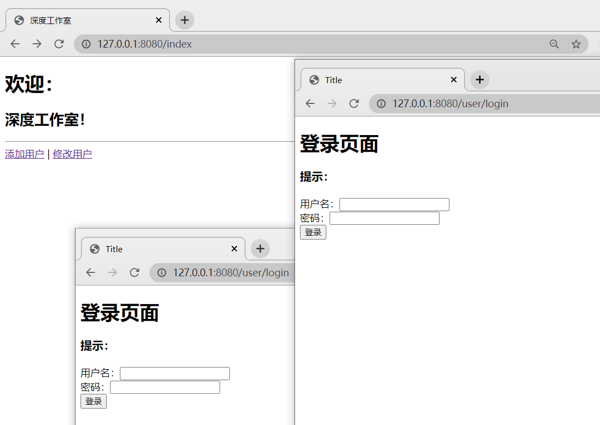


## （五）编写登录认证的逻辑


7、LoginController类添加用户登录逻辑

> 编写Shiro认证的逻辑，一共大概是4个步骤
>
> 1、获取Subject
>        Subject subject = SecurityUtils.getSubject();
>
> 2、封装用户数据
>         UsernamePasswordToken token = new UsernamePasswordToken(name, password);
>
> 3、执行登录方法
>             subject.login(token);
>
> 4、根据结果执行不同的动作（成功了，失败了（用户名不存在、密码错误等））


```java
    /**
     * 登录接口
     * @return
     */
    @RequestMapping("/login")
    public String login(String name, String password, Model model) {

        log.info("正在登录啦啦啦");

        //使用Shiro编写认证的逻辑
        //1、获取Subject
        Subject subject = SecurityUtils.getSubject();

        //2、封装用户数据
        UsernamePasswordToken token = new UsernamePasswordToken(name, password);

        //3、执行登录方法
        try {
            subject.login(token);
            model.addAttribute("msg", "login success");

            //登陆成功
            return "redirect:/index";

            //用户名不存在
        } catch (UnknownAccountException uae) {
            log.info("There is no user with username of " + token.getPrincipal());
            model.addAttribute("msg", "There is no user with username of");

            return "/user/login";
            //密码错误
        } catch (IncorrectCredentialsException ice) {
            log.info("Password for account " + token.getPrincipal() + " was incorrect!");
            model.addAttribute("msg", "Password for account " + token.getPrincipal() + " was incorrect!");

            return "/user/login";
        } catch (LockedAccountException lae) {
            log.info("The account for username " + token.getPrincipal() + " is locked.  " +
                    "Please contact your administrator to unlock it.");
            model.addAttribute("msg", "The account for username " + token.getPrincipal() + " is locked.  " +
                    "Please contact your administrator to unlock it.");

            return "/user/login";
        } catch (AuthenticationException ae) {
            //unexpected condition?  error?
            return "/user/login";
        }
    }
```


8、测试

> 可以看到无论你怎么输入都是提示有错误的。
>
> 因为我们的认证逻辑中是返回的null，并没有去处理一系列的逻辑（判断账号密码是否有问题等）。
>
> 


上面这一步也是必不可少的，如果你出现不了，那么就需要继续研究下了。


9、添加认证的逻辑

> 认证的逻辑无非就是判断账号和密码是否有效。


修改UserRealm.java中的doGetAuthenticationInfo方法如下：

```java
    /**
     * 执行认证逻辑
     * @param authenticationToken
     * @return
     * @throws AuthenticationException
     */
    @Override
    protected AuthenticationInfo doGetAuthenticationInfo(AuthenticationToken authenticationToken) throws AuthenticationException {
        log.info("我进入到了认证的逻辑当中");

        //假设数据库的用户名和密码
        String name = "admin";
        String password = "admin";

        //编写shiro判断逻辑，判断用户名和密码

        UsernamePasswordToken token = (UsernamePasswordToken)authenticationToken;

        //账号密码都正确
        if(token.getUsername().equals(name) && token.getPassword().equals(password)){
            //用户名不存在
            log.info("用户名不存在----");
            return null; //shiro底层会抛出异常，进行处理
        }

        //此处密码需为数据库中存放的正确的密码
        return new SimpleAuthenticationInfo("",password,"");
    }
```


10、测试


账号密码不对的时候：


到此为止，我们例如java写死的用户名和密码就生效了。


# 六、Shiro集成Mybatis

## （一）SpringBoot集成Mybatis

1、引入相关依赖：

```xml
        <!--        Mysql驱动-->
        <dependency>
            <groupId>mysql</groupId>
            <artifactId>mysql-connector-java</artifactId>
            <version>5.1.48</version>
        </dependency>

<!--        数据库连接池-->
        <dependency>
            <groupId>com.alibaba</groupId>
            <artifactId>druid</artifactId>
            <version>1.1.22</version>
        </dependency>

<!--        mybatis-->
        <dependency>
            <groupId>org.mybatis.spring.boot</groupId>
            <artifactId>mybatis-spring-boot-starter</artifactId>
            <version>2.1.2</version>
        </dependency>
```


2、配置yml文件

```properties
spring:
  datasource:
    driver-class-name: com.mysql.jdbc.Driver
    url: jdbc:mysql://你数据库的IP:3306/test
    username: root
    password: 123456
    type: com.alibaba.druid.pool.DruidDataSource

#mybatis别名包的位置，进行扫描
mybatis:
  type-aliases-package: com.shendu.springbootshiro.bean
  mapperLocations: classpath:mapper/*.xml
```


并创建相关的目录

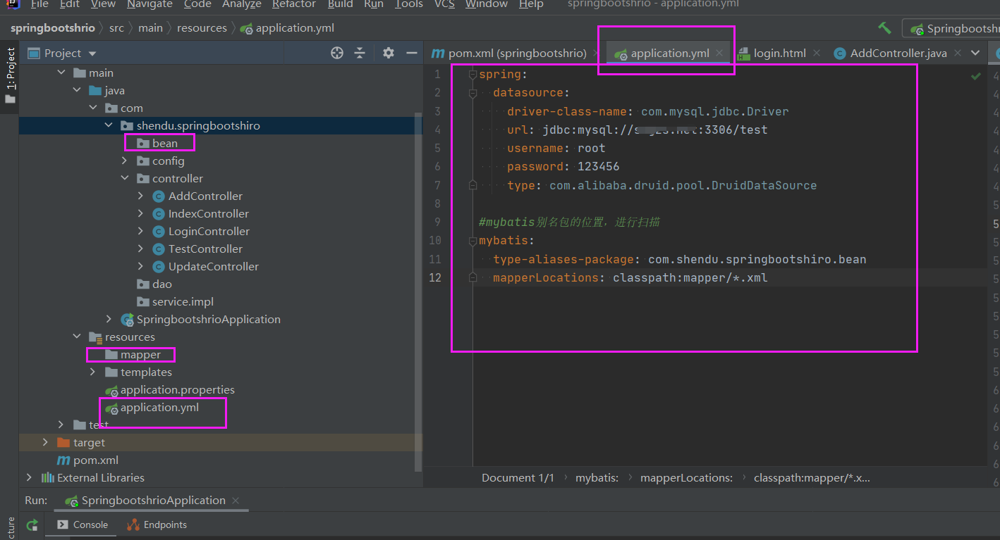


3、sql

```sql
create table student
(
    id       int auto_increment comment 'id'
        primary key,
    sno      varchar(20) null comment '学号',
    sname    varchar(10) null comment '学生姓名',
    password varchar(20) null comment '密码'
);

INSERT INTO test.student (id, sno, sname, password) VALUES (1, '202001', '张三', '123456');
INSERT INTO test.student (id, sno, sname, password) VALUES (2, '202002', '李四', '123456');
INSERT INTO test.student (id, sno, sname, password) VALUES (3, '202003', '王五', '123456');
INSERT INTO test.student (id, sno, sname, password) VALUES (4, '202004', '赵六', '123456');
INSERT INTO test.student (id, sno, sname, password) VALUES (5, '202005', '小明', '123456');
INSERT INTO test.student (id, sno, sname, password) VALUES (6, '202006', '小红', '123456');
INSERT INTO test.student (id, sno, sname, password) VALUES (7, '202007', '小刚', '123456');
INSERT INTO test.student (id, sno, sname, password) VALUES (8, '202008', '小李', '123456');
```


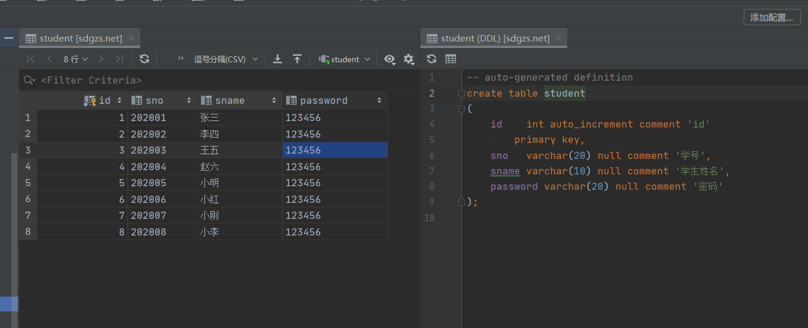


4、创建bean实体类

```java
package com.shendu.springbootshiro.bean;

/**
 * @program: springbootshrio
 * @description:
 * @author: zhengh
 * @create: 2020-10-25 20:52
 **/

public class Student {
    private Integer id;
    private String sno;
    private String sname;
    private String password;

    public Integer getId() {
        return id;
    }

    public void setId(Integer id) {
        this.id = id;
    }

    public String getSno() {
        return sno;
    }

    public void setSno(String sno) {
        this.sno = sno;
    }

    public String getSname() {
        return sname;
    }

    public void setSname(String sname) {
        this.sname = sname;
    }

    public String getPassword() {
        return password;
    }

    public void setPassword(String password) {
        this.password = password;
    }
}

```


5、创建StudentDao.java

```java
package com.shendu.springbootshiro.dao;


import com.shendu.springbootshiro.bean.Student;

/**
 * @program: springboot-shiro
 * @description:
 * @author: zhengh
 * @create: 2020-10-25 18:24
 **/

public interface StudentDao {

    //查询学号
    Student findByStudentSno(String sno);

}
```


6、创建StudentService.java

```java
package com.shendu.springbootshiro.service;

import com.shendu.springbootshiro.bean.Student;
import org.springframework.stereotype.Service;

/**
 * @program: springboot-shiro
 * @description:
 * @author: zhengh
 * @create: 2020-10-25 18:32
 **/
@Service
public interface StudentService {
    //查询学号
    Student findByStudentSno(String sno);

}

```


7、创建impl实现类

```java
package com.shendu.springbootshiro.service.impl;

import com.shendu.springbootshiro.bean.Student;
import com.shendu.springbootshiro.dao.StudentDao;
import com.shendu.springbootshiro.service.StudentService;
import org.springframework.beans.factory.annotation.Autowired;
import org.springframework.stereotype.Service;

/**
 * @program: springboot-shiro
 * @description:
 * @author: zhengh
 * @create: 2020-10-25 18:33
 **/

@Service
public class StudentServiceImpl implements StudentService {

    @Autowired
    private StudentDao studentDao;


    @Override
    public Student findByStudentSno(String sno) {
        return studentDao.findByStudentSno(sno);
    }


}

```


8、创建StudentMapper.xml文件

```xml
<?xml version="1.0" encoding="UTF-8" ?>
<!DOCTYPE mapper PUBLIC "-//mybatis.org//DTD Mapper 3.0//EN" "http://mybatis.org/dtd/mybatis-3-mapper.dtd" >

<mapper namespace="com.shendu.springbootshiro.dao.StudentDao" >

  <select id="findByStudentSno" parameterType="String" resultType="student">
        select * from student st where st.sno = #{sno}
  </select>

</mapper>
```


9、给启动类加上@MapperScan，让扫描到dao包

```java

@SpringBootApplication
@MapperScan("com.shendu.springbootshiro.dao")
public class SpringbootshrioApplication {

    public static void main(String[] args) {
        SpringApplication.run(SpringbootshrioApplication.class, args);
    }

}
```


至此为止，项目目录，结构如下：


10、写个单元测试，测试是否可以正确连接到数据，并完成操作


测试代码：

```java
@SpringBootTest
class SpringbootshrioApplicationTests {

    @Autowired
    StudentService studentService;

    @Test
    void contextLoads() {
        Student byStudentSno = studentService.findByStudentSno("202001");
        System.out.println(byStudentSno);
    }

}
```


此处需要注意的是我又回去在Student中重写了toString方法

出现下图内容，说明成功了：


## （二）Shiro查找数据库验证账号密码

我们需要修改执行认证的逻辑，在自定义的Realm类中。


```java
package com.shendu.springbootshiro.config;

import com.shendu.springbootshiro.bean.Student;
import com.shendu.springbootshiro.service.StudentService;
import org.apache.shiro.authc.*;
import org.apache.shiro.authz.AuthorizationInfo;
import org.apache.shiro.realm.AuthorizingRealm;
import org.apache.shiro.subject.PrincipalCollection;
import org.slf4j.Logger;
import org.slf4j.LoggerFactory;
import org.springframework.beans.factory.annotation.Autowired;

/**
 * @program: springboot-shiro
 * @description:
 * @author: zhengh
 * @create: 2020-10-25 17:03
 **/

public class UserRealm extends AuthorizingRealm {
    private static final transient Logger log = LoggerFactory.getLogger(UserRealm.class);

    /**
     * 执行授权的逻辑
     * @param principalCollection
     * @return
     */
    @Override
    protected AuthorizationInfo doGetAuthorizationInfo(PrincipalCollection principalCollection) {
        log.info("我进入到了授权的逻辑当中");
        return null;
    }


    @Autowired
    StudentService studentService;


    /**
     * 执行认证逻辑
     * @param authenticationToken
     * @return
     * @throws AuthenticationException
     */
    @Override
    protected AuthenticationInfo doGetAuthenticationInfo(AuthenticationToken authenticationToken) throws AuthenticationException {
        log.info("我进入到了认证的逻辑当中");

        /*
             ---------> 第一种：写死账号密码测试用   <----------
         */
       /* //假设数据库的用户名和密码
        String name = "admin";
        String password = "admin";

        //编写shiro判断逻辑，判断用户名和密码

        UsernamePasswordToken token = (UsernamePasswordToken)authenticationToken;

        //账号密码都正确
        if(token.getUsername().equals(name) && token.getPassword().equals(password)){
            //用户名不存在
            log.info("用户名不存在----");
            return null; //shiro底层会抛出异常，进行处理
        }

        //此处密码需为数据库中存放的正确的密码
        return new SimpleAuthenticationInfo("",password,"");*/

         /*
             ---------> 第二种：去数据库中查询   <----------
         */

        //假设数据库的用户名和密码

        //编写shiro判断逻辑，判断用户名和密码


        UsernamePasswordToken token = (UsernamePasswordToken)authenticationToken;
        String sno = token.getUsername() == null ? "" : token.getUsername();
        String password = token.getPassword() == null ? "" : token.getPassword().toString() ;

        Student byStudentSno = studentService.findByStudentSno(sno);

        log.info("从数据库中查到的:"+byStudentSno.toString());
        
        //账号正确
        if(byStudentSno==null){
            //用户名不存在
            log.info("用户名不存在----");
            return null; //shiro底层会抛出异常，进行处理
        }

        //此处密码需为数据库中存放的正确的密码
        return new SimpleAuthenticationInfo("",byStudentSno.getPassword(),"");
    }

}
```


测试：

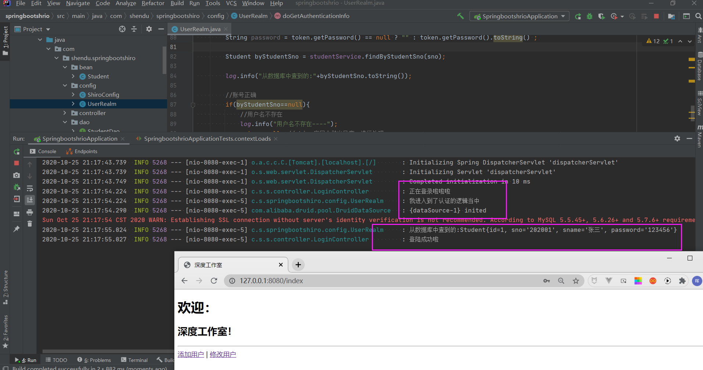


输入错误的密码：

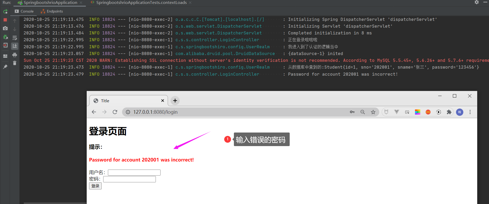


# 七、Shiro几种授权的模式

```
Shiro内置过滤器，可以实现权限相关的拦截器
 常用的几种：
     1、anon：无需认证（登录）就可以访问
     2、authc：必须认证才可以访问
     3、user：必须拥有 “记住我” 功能才能用(如果使用remeberMe的功能可以直接访问)
     4、perms：拥有某个资源的权限才能访问
     5、role：拥有某个角色权限才能访问
```

## （一）authc模式

authc模式就是指定谁认证，就认证谁。

```java
      //定义存放认证规则的map
        Map<String, String> filterMap = new HashMap<>();
        //对单个url进行拦截  拦截add和update页面的访问，必须认证才可访问
        filterMap.put("/add","authc");
        filterMap.put("/update","authc");
```


也可以写成，拦截所有的,进行认证：

```java
//拦截所有的,进行认证
filterMap.put("/*","authc");
```


拦截/user/下的所有的url，进行认证：

```java
filterMap.put("/user/*","authc");
```


## （二）anon模式

> 在我们的业务代码中，肯定不是像我之前写的那样子，只针对某个url进行放行，如果项目中有成千上万个接口，那就是要写成千上万次了。所以大多数是拦截所有的，放行少部分的。


我们修改如下：

```java
     //定义存放认证规则的map
        Map<String, String> filterMap = new HashMap<>();
        //对单个url进行拦截  拦截add和update页面的访问，必须认证才可访问
//        filterMap.put("/add","authc");
//        filterMap.put("/update","authc");

        //拦截所有的,进行认证
        filterMap.put("/*","authc");

        //放开主页面
        filterMap.put("/index","anon");
        //放开登录页面
        filterMap.put("/user/login","anon");
        //放开登录提交数据的接口
        filterMap.put("/login","anon");
```


## （四）perms模式


我们需要创建一个页面，让访问未授权的资源时跳转到该html中。


目录结构如下：


1、创建html:

```html
<!DOCTYPE html>
<html lang="en">
<head>
    <meta charset="UTF-8">
    <title>Title</title>
</head>
<body>

<h1 style="color: red">抱歉未授权哦！</h1>

</body>
</html>
```


2、Controller类：

```java
package com.shendu.springbootshiro.controller;


/**
 * @program: springbootshrio
 * @description:
 * @author: zhengh
 * @create: 2020-10-25 21:43
 **/
@Controller
public class UnauthorizedController {

    @GetMapping("/unauthorized")
    public String index(){
        return "unauthorized";
    }

}
```


3、配置拦截器

```java
//针对perms：拦截/add路径
filterMap.put("/add","perms[user:add]");

//设置未授权的页面url
shiroFilterFactoryBean.setUnauthorizedUrl("unauthorized");
```


测试：


**编写资源授权逻辑：**

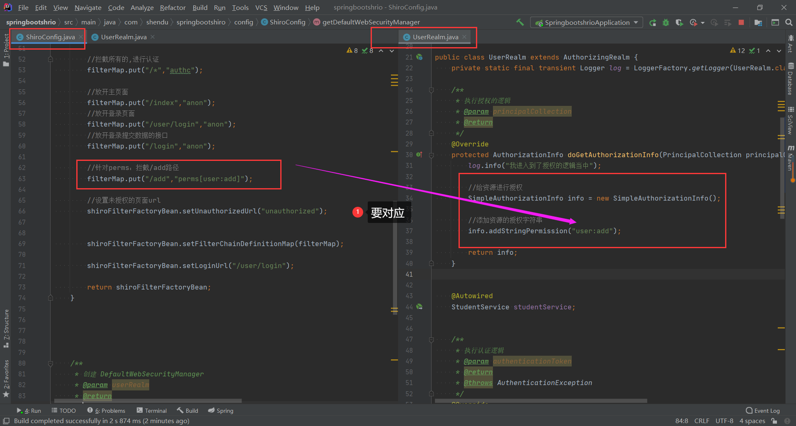

```java
    /**
     * 执行授权的逻辑
     * @param principalCollection
     * @return
     */
    @Override
    protected AuthorizationInfo doGetAuthorizationInfo(PrincipalCollection principalCollection) {
        log.info("我进入到了授权的逻辑当中");

        //给资源进行授权
        SimpleAuthorizationInfo info = new SimpleAuthorizationInfo();

        //添加资源的授权字符串
        info.addStringPermission("user:add");

        return info;
    }
```


再次访问就可以了

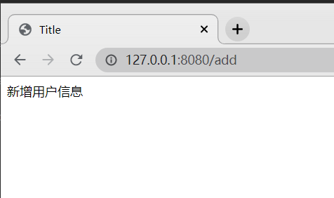


## （五）连接数据库动态授权

1、修改表结构，新增权限字段

为了好演示，我们直接在Studetn表增加一个权限字段（真实当中肯定不是一个表的哈

）。

```sql
alter table student
	add perms varchar(20) null comment '权限';
    
```

2、修改数据

然后修改两个用户的权限：

```sql
test> UPDATE test.student t SET t.perms = 'user:update' WHERE t.id = 2
test> UPDATE test.student t SET t.perms = 'user:add' WHERE t.id = 1
```

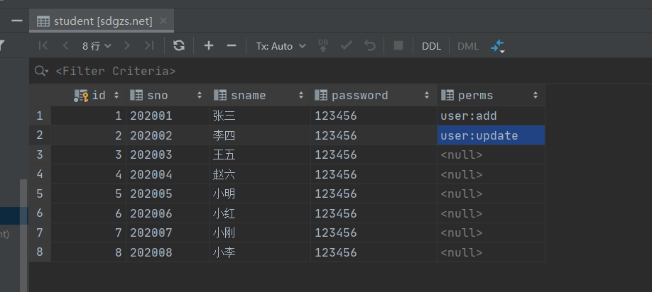


3、修改Student实体类，增加perms属性和get、set方法

```java
    private String perms;

    public String getPerms() {
        return perms;
    }

    public void setPerms(String perms) {
        this.perms = perms;
    }
```


4、dao层新增一个接口：

```java
    //根据学号查询授权
    Student findBySno(String Sno);
```


5、service层

```java
   //根据学号查询授权
    Student findBySno(String Sno);
```


6、impl

```java
 @Override
    public Student findBySno(String Sno) {
        return studentDao.findBySno(Sno);
    }
```


7、mapper

```xml

<select id="findBySno" parameterType="String" resultType="student">
        select * from student st where st.sno = #{sno}
  </select>
```


8、修改自定义的Realm向数据库中动态的查询权限


UserRealm.java

```java
package com.shendu.springbootshiro.config;

import com.shendu.springbootshiro.bean.Student;
import com.shendu.springbootshiro.service.StudentService;
import org.apache.shiro.SecurityUtils;
import org.apache.shiro.authc.*;
import org.apache.shiro.authz.AuthorizationInfo;
import org.apache.shiro.authz.SimpleAuthorizationInfo;
import org.apache.shiro.realm.AuthorizingRealm;
import org.apache.shiro.subject.PrincipalCollection;
import org.apache.shiro.subject.Subject;
import org.slf4j.Logger;
import org.slf4j.LoggerFactory;
import org.springframework.beans.factory.annotation.Autowired;

/**
 * @program: springboot-shiro
 * @description:
 * @author: zhengh
 * @create: 2020-10-25 17:03
 **/

public class UserRealm extends AuthorizingRealm {
    private static final transient Logger log = LoggerFactory.getLogger(UserRealm.class);

    @Autowired
    StudentService studentService;

    /**
     * 执行授权的逻辑
     * @param principalCollection
     * @return
     */
    @Override
    protected AuthorizationInfo doGetAuthorizationInfo(PrincipalCollection principalCollection) {
        log.info("我进入到了授权的逻辑当中");
        //给资源进行授权
        SimpleAuthorizationInfo info = new SimpleAuthorizationInfo();
        //添加资源的授权字符串
//        info.addStringPermission("user:add");
        //到数据库中查询当前登录用户的权限
        //1、拿到传递过来的用户数据
        Subject subject = SecurityUtils.getSubject();
        Student student = (Student)subject.getPrincipal();
        //2、根据用户信息，查询是否授权
        Student ps = studentService.findBySno(student.getSno());
        log.info("查询授权的用户："+ps);
        info.addStringPermission(ps.getPerms());
        return info;
    }


    /**
     * 执行认证逻辑
     * @param authenticationToken
     * @return
     * @throws AuthenticationException
     */
    @Override
    protected AuthenticationInfo doGetAuthenticationInfo(AuthenticationToken authenticationToken) throws AuthenticationException {
        log.info("我进入到了认证的逻辑当中");
        /*
             ---------> 第一种：写死账号密码测试用   <----------
         */
       /* //假设数据库的用户名和密码
        String name = "admin";
        String password = "admin";

        //编写shiro判断逻辑，判断用户名和密码

        UsernamePasswordToken token = (UsernamePasswordToken)authenticationToken;

        //账号密码都正确
        if(token.getUsername().equals(name) && token.getPassword().equals(password)){
            //用户名不存在
            log.info("用户名不存在----");
            return null; //shiro底层会抛出异常，进行处理
        }

        //此处密码需为数据库中存放的正确的密码
        return new SimpleAuthenticationInfo("",password,"");*/
         /*
             ---------> 第二种：去数据库中查询   <----------
         */
        //假设数据库的用户名和密码

        //编写shiro判断逻辑，判断用户名和密码
        UsernamePasswordToken token = (UsernamePasswordToken)authenticationToken;
        String sno = token.getUsername() == null ? "" : token.getUsername();
        String password = token.getPassword() == null ? "" : token.getPassword().toString() ;
        Student byStudentSno = studentService.findByStudentSno(sno);
        log.info("从数据库中查到的:"+byStudentSno.toString());
        //账号正确
        if(byStudentSno==null){
            //用户名不存在
            log.info("用户名不存在----");
            return null; //shiro底层会抛出异常，进行处理
        }
        //此处密码需为数据库中存放的正确的密码
        return new SimpleAuthenticationInfo(byStudentSno,byStudentSno.getPassword(),"");
    }

}

```


ShiroConfig.java

```java
package com.shendu.springbootshiro.config;

import org.apache.shiro.spring.web.ShiroFilterFactoryBean;
import org.apache.shiro.web.mgt.DefaultWebSecurityManager;
import org.slf4j.Logger;
import org.slf4j.LoggerFactory;
import org.springframework.beans.factory.annotation.Qualifier;
import org.springframework.context.annotation.Bean;
import org.springframework.context.annotation.Configuration;

import java.util.HashMap;
import java.util.Map;

/**
 * @program: springboot-shiro
 * @description:
 * @author: zhengh
 * @create: 2020-10-25 17:02
 **/
@Configuration
public class ShiroConfig {

    private static final transient Logger log = LoggerFactory.getLogger(ShiroConfig.class);


    @Bean
    public ShiroFilterFactoryBean getShiroFilterFactoryBean(@Qualifier("defaultWebSecurityManager")DefaultWebSecurityManager securityManager){

        log.info("进入到了：getShiroFilterFactoryBean中");

        ShiroFilterFactoryBean shiroFilterFactoryBean = new ShiroFilterFactoryBean();

        //1、设置安全管理器
        shiroFilterFactoryBean.setSecurityManager(securityManager);

        //2、添加Shito内置过滤器
        /**
         * Shiro内置过滤器，可以实现权限相关的拦截器
         *  常用的几种：
         *      1、anon：无需认证（登录）就可以访问
         *      2、authc：必须认证才可以访问
         *      3、user：如果使用remeberMe的功能可以直接访问
         *      4、perms：该资源必须得到资源权限才可以访问
         *      5、role：：该资源必须得到角色权限才可以访问
         */
        //定义存放认证规则的map
        Map<String, String> filterMap = new HashMap<>();
        //对单个url进行拦截  拦截add和update页面的访问，必须认证才可访问
//        filterMap.put("/add","authc");
//        filterMap.put("/update","authc");

        //拦截所有的,进行认证
        filterMap.put("/*","authc");

        //放开主页面
        filterMap.put("/index","anon");
        //放开登录页面
        filterMap.put("/user/login","anon");
        //放开登录提交数据的接口
        filterMap.put("/login","anon");

        //针对perms：拦截/add路径
        filterMap.put("/add","perms[user:add]");
        filterMap.put("/update","perms[user:update]");

        //设置未授权的页面url
        shiroFilterFactoryBean.setUnauthorizedUrl("unauthorized");


        shiroFilterFactoryBean.setFilterChainDefinitionMap(filterMap);

        shiroFilterFactoryBean.setLoginUrl("/user/login");

        return shiroFilterFactoryBean;
    }


    /**
     * 创建 DefaultWebSecurityManager
     * @param userRealm
     * @return
     */
    @Bean(name = "defaultWebSecurityManager")
    public DefaultWebSecurityManager getDefaultWebSecurityManager(@Qualifier("userRealm") UserRealm userRealm){
        //关联realm
        DefaultWebSecurityManager securityManager = new DefaultWebSecurityManager();
        securityManager.setRealm(userRealm);

        return securityManager;
    }


    /**
     * 创建Realm
     * @return
     */
    @Bean(name = "userRealm")
    public UserRealm getRelm(){
        return new UserRealm();
    }

}

```


测试：


