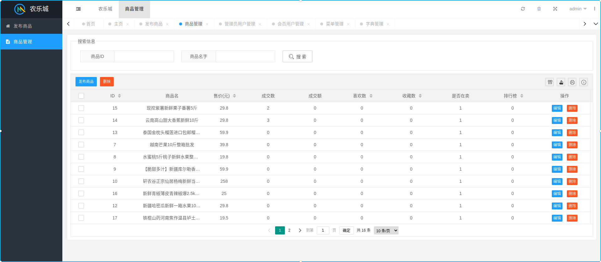
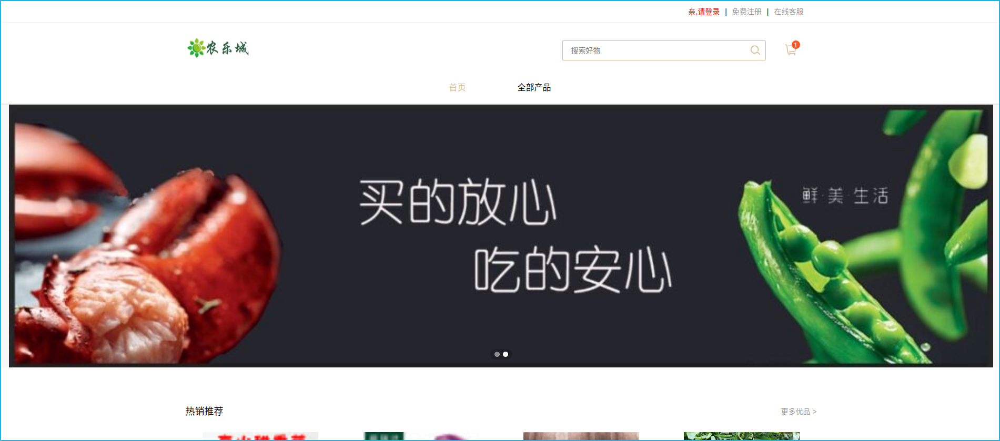
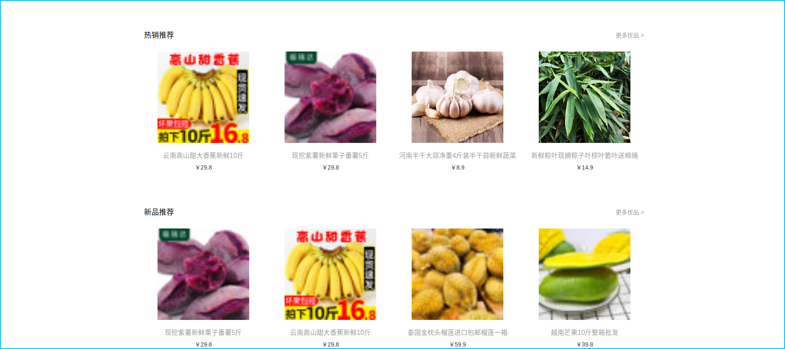
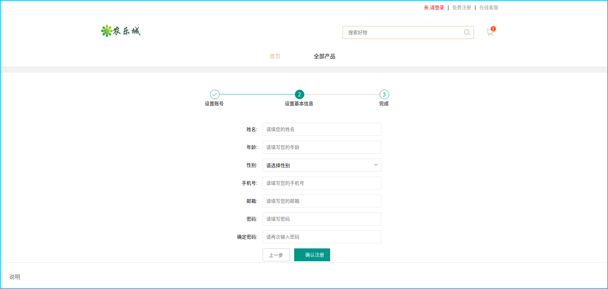
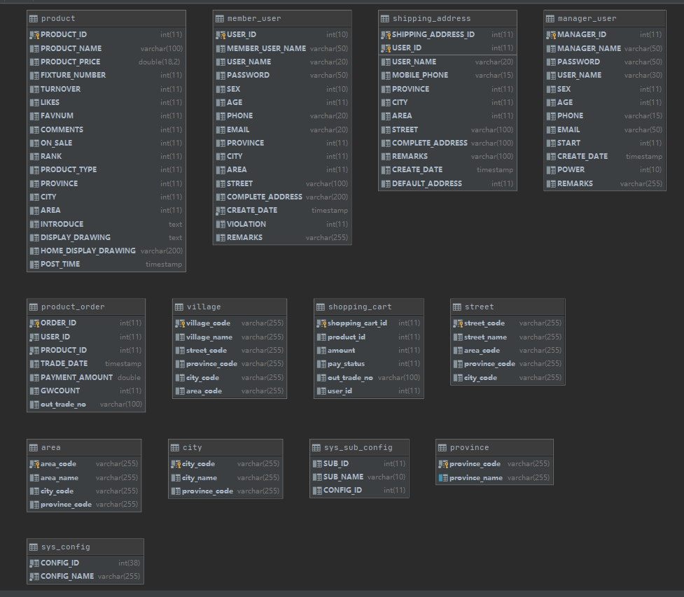

# agriculture


## 一、前言

`agriculture`项目致力于采用现阶段流行技术打造一个完整的农业的电商系统。


## 二、项目文档


## 三、项目介绍

本项目采用前后端分离来分别开发的。


`agriculture`项目是一套农业类电商系统，包括前台商城系统及后台管理系统，基于SpringBoot+MyBatis实现，采用Docker容器化部署。

前台商城系统包含商品推荐、商品搜索、商品展示、购物车、订单流程、会员中心、帮助中心等模块。

后台管理系统包含商品管理、订单管理、会员管理、内容管理、权限管理、设置等模块。


更多功能还打造中…。


## 四、项目展示

### （一）后台管理系统





### （二）前台商城系统









采用了推荐算法：


## 五、组织结构

本项目采用前后端分离来分别开发的。

```lua
agriculture
├── agriculture-admin -- 农乐城后端管理系统
├── agriculture-home  -- 农乐城前端系统
└── agriculture-boot -- 农乐城后端管理系统接口
    ├── /cn/agriculture/configuration -- 后端SpringBoot等相关配置文件
    ├── /cn/agriculture/controller -- 后端Controller层java代码
    ├── /cn/agriculture/dao -- 后端Dao层java代码
	├── /cn/agriculture/entity -- 实体类代码
	├── /cn/agriculture/service -- 后端Service层java代码
	└── /cn/agriculture/utils -- 后端封装的相关的工具类java代码
        ├── /alipay -- 支付宝支付工具包
        ├── /base64 -- 图片转码工具包
		├── /canal  -- 验证码工具包
        ├── /MapUtil -- Map处理相关工具包
		├── /ProductRecommendUtils --推荐系统工具包
		├── /redis --推荐系统工具包
		├── /ShoppingUtils --购物车工具包
		├── OssUtil --阿里云OSS服务器工具类
        └── ResultUtils -- 消息封装集合
```


## 六、技术选型


### （一）后端技术

| 技术             | 说明                | 官网                                           |
| ---------------- | ------------------- | ---------------------------------------------- |
| SpringBoot       | 容器+MVC框架        | https://spring.io/projects/spring-boot         |
| SpringSecurity   | 认证和授权框架      | https://spring.io/projects/spring-security     |
| MyBatis          | ORM框架             | http://www.mybatis.org/mybatis-3/zh/index.html |
| MyBatisGenerator | 数据层代码生成      | http://www.mybatis.org/generator/index.html    |
| PageHelper       | MyBatis物理分页插件 | http://git.oschina.net/free/Mybatis_PageHelper |
| Swagger-UI       | 文档生产工具        | https://github.com/swagger-api/swagger-ui      |
| Redis            | 分布式缓存          | https://redis.io/                              |
| Docker           | 应用容器引擎        | https://www.docker.com                         |
| Druid            | 数据库连接池        | https://github.com/alibaba/druid               |
| OSS              | 对象存储            | https://github.com/aliyun/aliyun-oss-java-sdk  |
| MongoDB          | NoSql数据库         | https://www.mongodb.com                        |
| Lombok           | 简化对象封装工具    | https://github.com/rzwitserloot/lombok         |
| Jenkins          | 自动化部署工具      | https://github.com/jenkinsci/jenkins           |
| Nginx            | 集群部署            | http://nginx.org/en/                           |
| Centos7          | 后端部署            |                                                |


### （二）前端技术

| 技术       | 说明                  | 官网                                   |
| ---------- | --------------------- | -------------------------------------- |
| Layui      | 前端框架              | <https://www.layui.com/>               |
| Js-cookie  | cookie管理工具        | https://github.com/js-cookie/js-cookie |


### 七、架构图

#### （一）系统架构图


#### （二）业务架构图


### 八、模块介绍


#### （一）后台管理系统


#### （二）前台商场系统


### 九、开发进度


## 十、环境搭建


### （一）开发工具


### （二）开发环境


### （三）搭建步骤


## 十一、数据库

Mysql5.7




## 十二、公众号


## 十三、开源许可证


