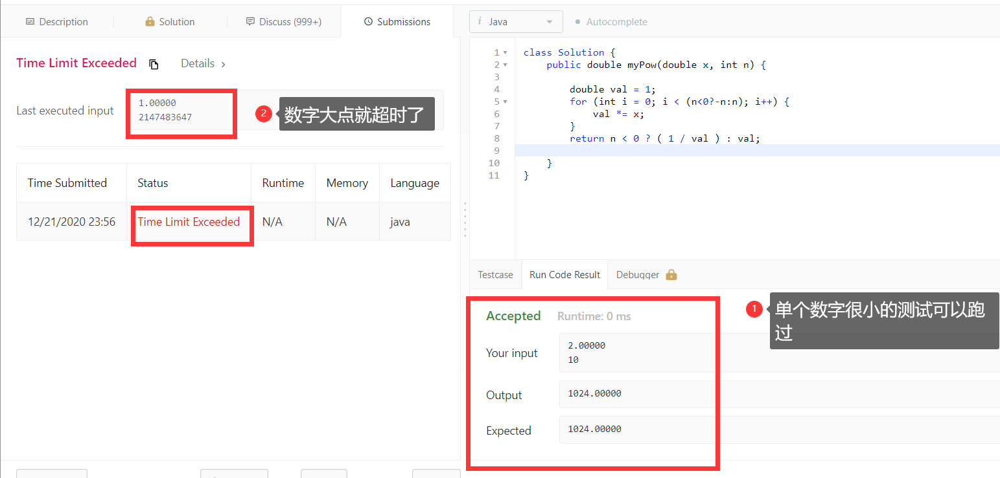
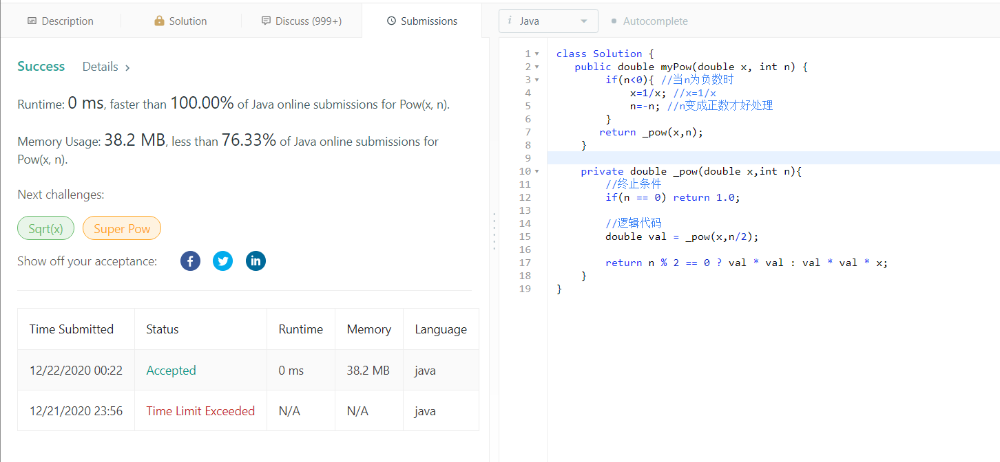

# 50. Pow(x, n)

## 1、题目

实现 pow(x, n) ，即计算 x 的 n 次幂函数。

示例 1:

> 输入: 2.00000, 10
> 输出: 1024.00000

示例 2:

> 输入: 2.10000, 3
> 输出: 9.26100

示例 3:

> 输入: 2.00000, -2
> 输出: 0.25000
>
> 解释: 2^-2 = 1/2^2 = 1/4 = 0.25

说明:

> -100.0 < x < 100.0
> n 是 32 位有符号整数，其数值范围是 [?231, 231 ? 1] 。


来源：力扣（LeetCode）
链接：https://leetcode-cn.com/problems/powx-n
著作权归领扣网络所有。商业转载请联系官方授权，非商业转载请注明出处。


## 2、题目解析


此题的要求是：实现一个pow函数可以输入x和n，然后计算x的n次幂。

如题所说的：实现 pow(x, n) ，即计算 x 的 n 次幂函数。


直接搬上来幂运算的定义肯定很多人头大，那么具体的定义如果大家不记得了，可以去百度一下回忆回忆，这里就不说了，只将运算的法则和技巧阐述一下：


我们只需要计算一个数的n次幂即可，所以必须要懂得x的n次幂如何计算。


我们比较关心的是n的值。

从示例中可以看出n的值是可以为负数的，所以在思考这道题的时候就需要把n为负数时的计算方式考虑进去。

那么我们可以把三个示例写成公式：

示例 1:

> 输入: x=2.00000, n=10
> 输出: 1024.00000


示例1我们可以写成如下公式：


$$
2^{10}= ?
$$


那么如何计算呢？

> x的n次幂就是n个x相乘，比如2的10次幂，就是10个2相乘，以此类推，如下所示。

$$
2^{10}=2*2*2*2*2*2*2*2*2*2=1024
$$


示例 3：


> 输入: x=2.00000, n=-2
> 输出: 0.25000
>
> 解释: 2^-2 = 1/2^2 = 1/4 = 0.25


示例 3我们可以写成如下公式:


$$
2^{-2}= ?
$$


现在n为负数，我们该如何计算呢？


当n为负数时，就需要根据如下公式来推导：


$$
x^{-n}=\frac{1}{x^n}
$$


例如：
$$
2^{-2}=\frac{1}{2^2}=\frac{1}{2}+\frac{1}{2}=\frac{1}{4}=0.25
$$


此时如果不明白1/2+1/2的，可以看下：

https://zhidao.baidu.com/question/128415593.html


分析总结：

当n为正数和负数的时候，我们分别有两个计算的逻辑；

**当n为正数**：
$$
2^{10}=2*2*2*2*2*2*2*2*2*2=1024
$$
**当n为负数**：
$$
2^{-2}=\frac{1}{2^2}=\frac{1}{4}=0.25
$$


## 3、设计题目


### （1）暴力法

> 通过上面我们分析2^10就是10个2相乘。
>
> 那么我们可以写个for循环，直接边循环边相乘就好了。
>
> 1、循环之前应该先判断一下n是否为负数，如果为负数的话，应该先改成正数进行循环；
>
> 2、循环n遍，然后定义一个val存放最终的值，n遍中进行*x；
>
> 3、如果n是负数的话，就返回1/val，如果n不是负数就直接返回n即可。


```java
public double myPow(double x, int n) {
    double val = 1;
    for (int i = 0; i < (n<0?-n:n); i++) {
        val *= x;
    }
    return n < 0 ? ( 1 / val ) : val;
}
```


但是时间复杂度肯定效率是没这么高的。

可以看到当n等于多少的时候，就会循环n次，所以时间复杂度是O(n)


可以看到，单个测试时没问题的；如果n的值很大，就会超时啦。




### （2）快速幂+递归法

为什么递归可以解决呢？


我们来进一步分析一下下面这个题：
$$
2^{10}=2*2*2*2*2*2*2*2*2*2=1024
$$


根据幂运算法则，可以推导出：可以拆分一下
$$
2^{10}=2^{5}*2^{5}=(2*2*2*2*2*2*2*2*2*2)
$$


那么2的5次方就等于：
$$
2^{5}=2^{2}*2^{2} * 2=(2*2)*(2*2)*2
$$


所以每次都可以减半。


那么时间复杂度就从O(n)降到了O(log n)，为递归的层数；


```java
  public double myPow(double x, int n) {
        if(n<0){ //当n为负数时
            x=1/x; //x=1/x
            n=-n; //n变成正数才好处理
        }
       return _pow(x,n);
    }

    private double _pow(double x,int n){
        //终止条件
        if(n == 0) return 1.0;

        //逻辑代码
        double val = _pow(x,n/2);

        return n % 2 == 0 ? val * val : val * val * x;
    }
```


可以看到现在就可以很快了：

