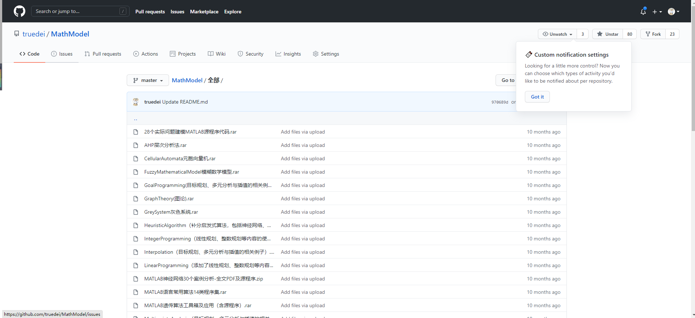

# 说明

> 最新的美赛、国赛、省赛数学建模，通用matlab编写的数十个实现的模型，优秀的论文，pdf资料，ppt资料等;The latest us, national, provincial mathematical modeling, general matlab prepared by dozens of models, excellent papers, PDF materials, PPT materials

此库的所有资料来源于网络，我只是稍做整理，便于他人一起学习交流。如有侵权，请立马联系我，我立马删除。
Email：8042965@qq.com
QQ:8042965

# 整理不易，对您有帮助的话麻烦给个Star，或者Fork吧

# 注意
大家可以持续关注下此仓库，会持续的更新，或者关注下我CSDN

# 整理的资料如下，只是大概的图

