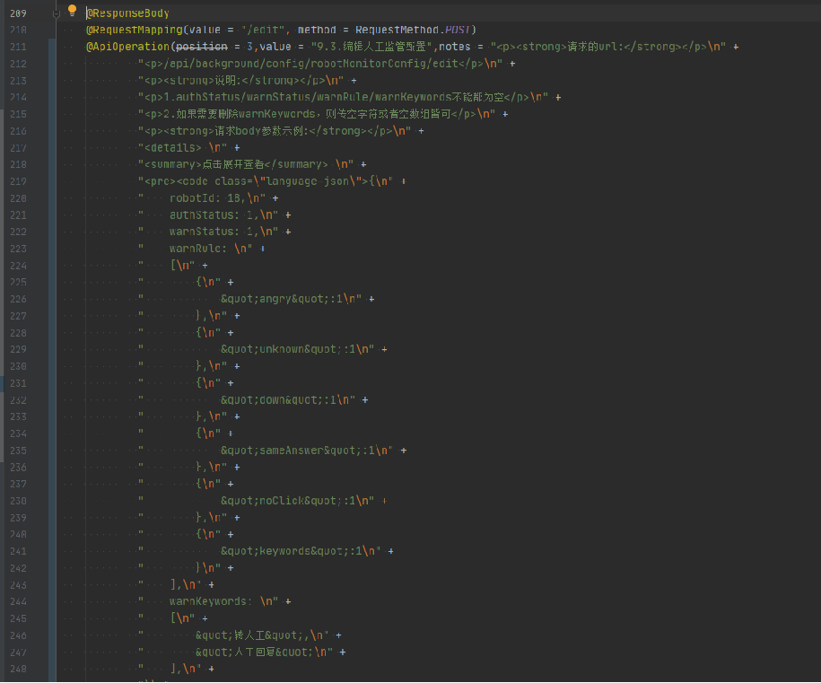
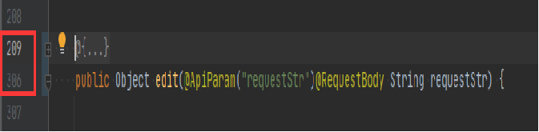
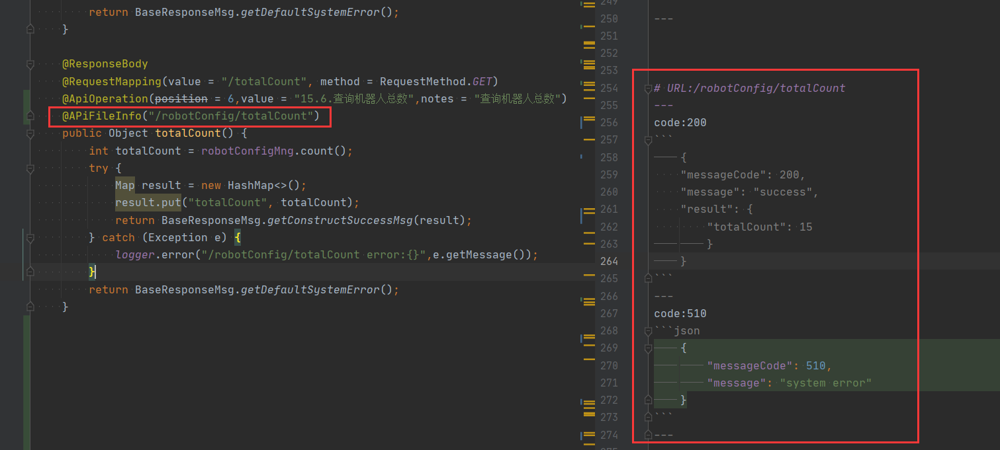
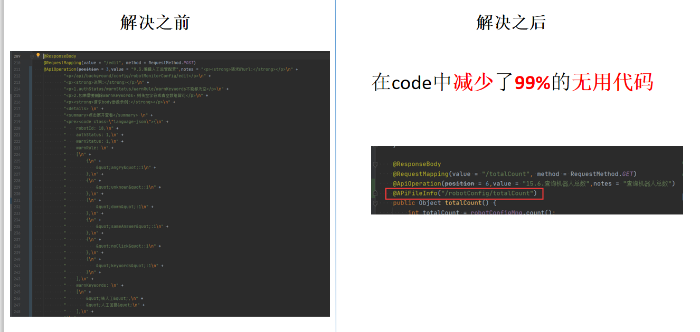
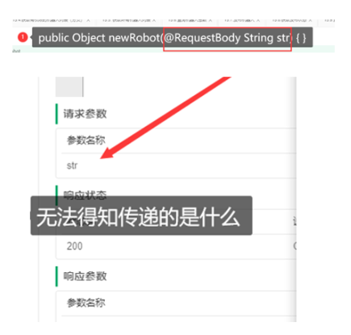
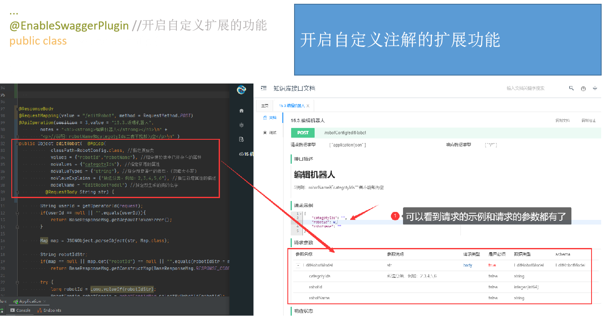
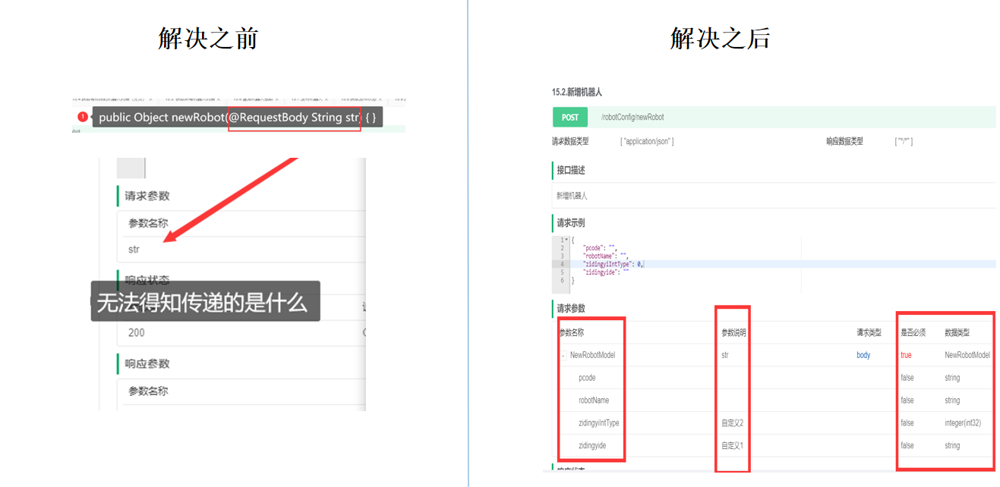
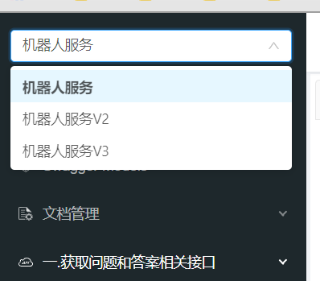

# truedei-swagger-plugin项目使用说明书

欢迎查看本文档和手册；

如果您有兴趣参与我们的小组和项目，请使用下面的联系方式和我们联系：

| 联系方式名称 | 联系方式                                          |
| ------------ | ------------------------------------------------- |
| 电子邮件     | [8042965@qq.com](mailto:8042965@qq.com)           |
| QQ           | 8042965                                           |
| 微信         | weiyi3700                                         |
| QQ 交流群1   | 1093169351（快满了）                              |
| 开源仓库地址 | https://github.com/truedei/truedei-swagger-plugin |

可以关注官方公众号，及时得到更新版本的最新消息：

## 一、项目背景

本项目是对swagger的一个额外功能的扩展。

同时集成了一款第三方的前端UI(swagger-bootstrap-ui)；

> 本项目产生的原因是，我们公司在使用swagger的时候，无法完成一些特定的功能（前端UI定制化服务）；

例如：

1、我们有一些接口是提供给第三方的，我们不想给其他第三方用户展示一些信息（没有必要的列）；

> 如下所示，通过跟swagger-bootstrap-ui作者的沟通，并不能实现动态的配置达到这个目的，只能通过修改源代码来解决这个问题。
>
> 增加了swagger使用者的复杂度。

我们这个框架，支持动态配置，让你选择是否显示你看到的一切信息。

2、接口描述的文本太多，全写在code里，侵入性太大，维护也不方便的问题

> 如果对接口有很多的描述信息，可以看到描述的信息会远远超过我们java的代码量。

> 居然有100行接口的描述

你只需要引用本项目的依赖，就可以在java代码中节省99.9%的无用code

> 下图的@ApiFileInfo就是用来解决这个问题的，可以看到原先100行，现在只需要1行就可以了

对比：

3、后端接收json字符串参数时，无法在界面显示的解决办法

> 当我们的接口需要传递body参数，并且使用String来接收的话，会给测试人员和前端人员造成一定的影响，并不能知道传递的是什么，如下图所示：

解决办法：

成果展示：

4、少量代码即可配置针对不同版本进行分组展示：

## 二、本框架支持和解决的问题

- [x] 1、 支持使用注解动态生成实体类（@Apicp & @ApiIgp）；
- [x] 2、 支持从文件中读取一些接口描述信息（@APiFileInfo）；
- [x] 3、 支持api分组（@ApiVersion）；
- [x] 4、 支持开启此扩展项目的开关的功能（@EnableSwaggerPlugin）；
- [x] 5、 @Apicp和ApiIgp支持参数示例;
- [x] 6、 @Apicp和ApiIgp支持参数是否必填选项;
- [x] 7、 支持配置从配置好的任意package路径读取md文件; 
- [x] 9、 配置相应的log日志输出功能;
- [ ] 10、支持参数排序;
- [ ] 11、前端UI，定制化组件

