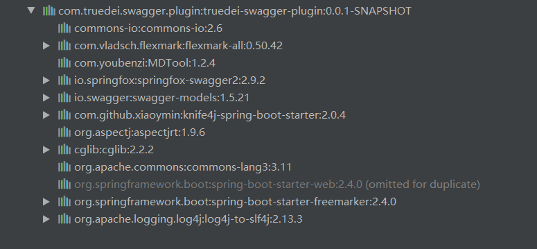
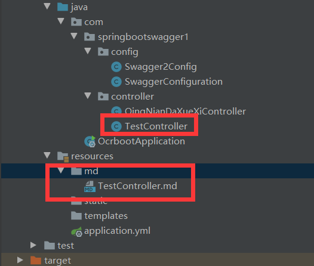
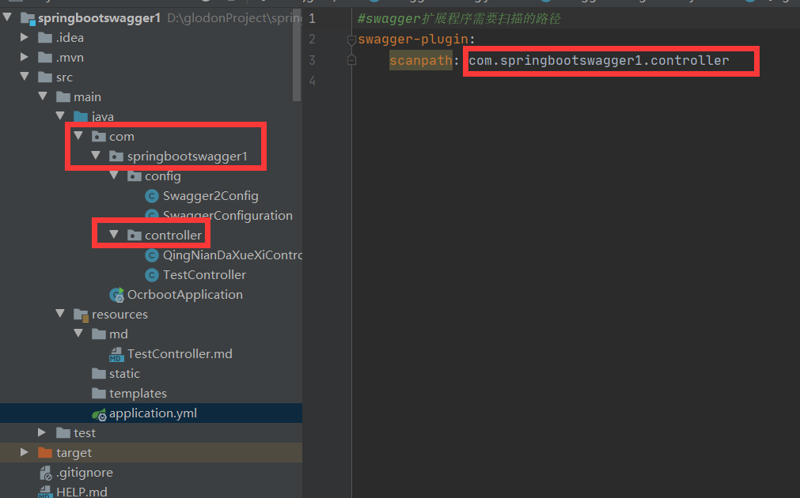
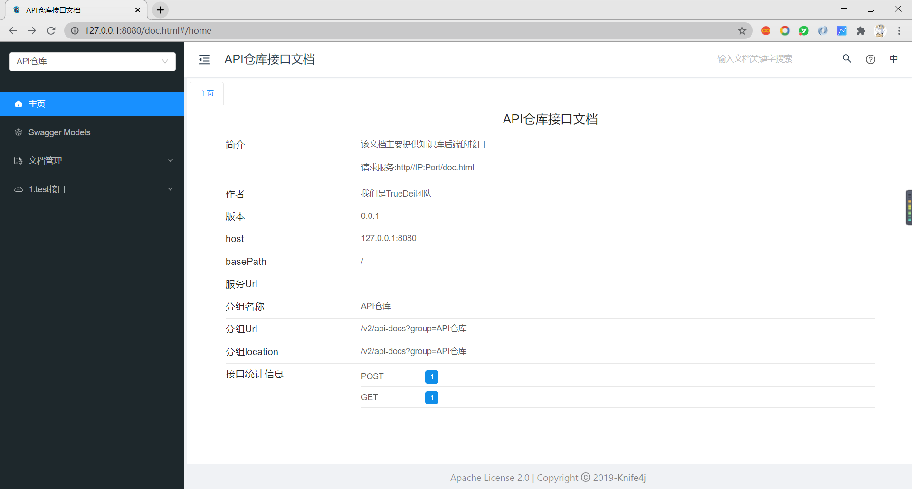
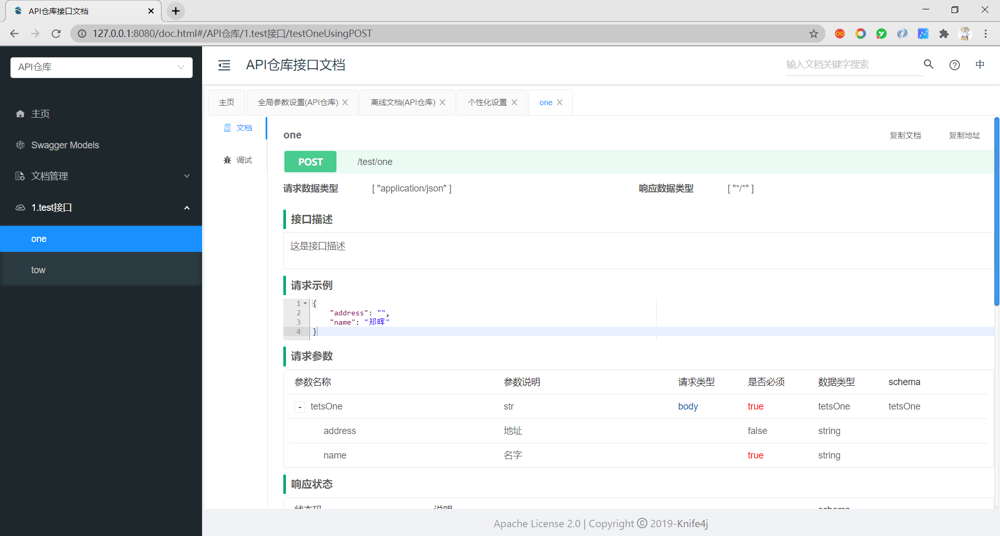
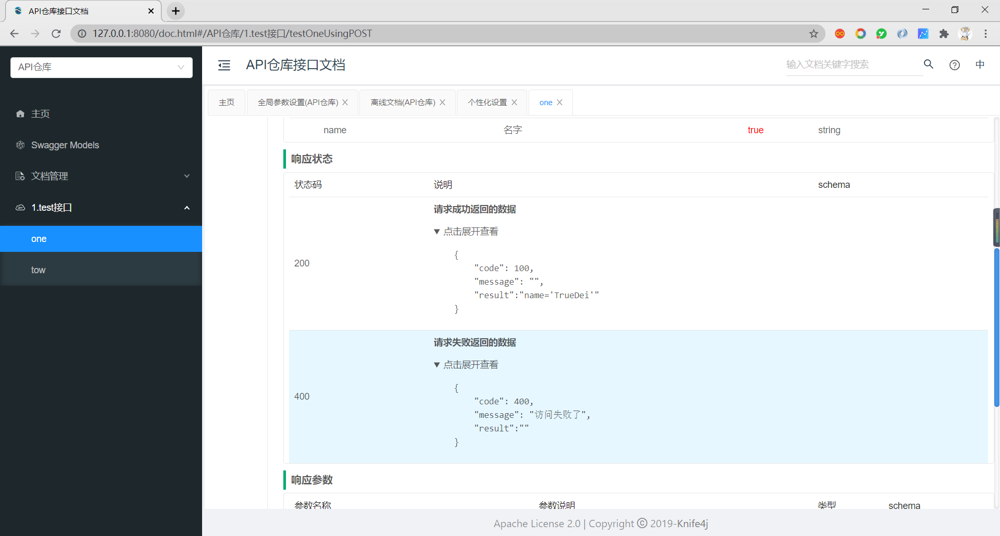
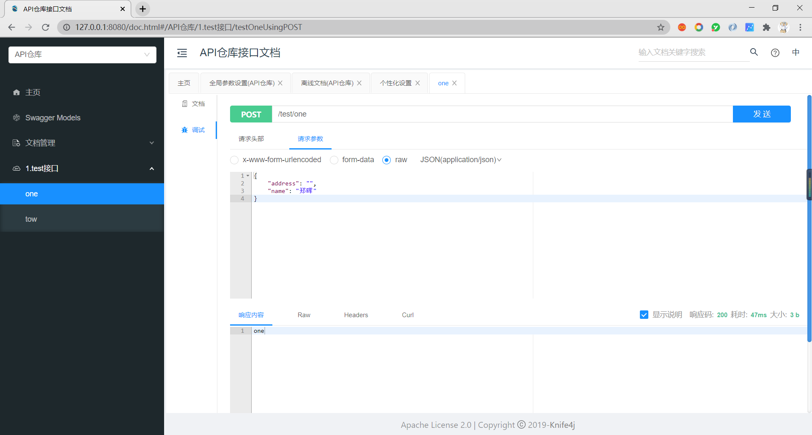

# 使用手册


# 一、引入依赖


> 在你的SpringBoot项目中的pom.xml文件中引入下面这个依赖即可

```xml
<dependency>
  <groupId>com.truedei.swagger.plugin</groupId>
  <artifactId>truedei-swagger-plugin</artifactId>
  <version>0.0.2-SNAPSHOT</version>
</dependency>
```


此依赖，包含如下依赖：




所以不必引入springfox和swagger-bootstrap-ui的依赖，我已集成好，做到了简化；


# 二、对Swagger的扩展的注解


| **注解**               | **作用对象** | **参数**                                                     | **说明**                                                     |
| ---------------------- | ------------ | ------------------------------------------------------------ | ------------------------------------------------------------ |
| @EnableSwaggerPlugin() | 类           | 无                                                           | 开启自定义扩展的功能                                         |
| @EnableApiFIleURI()    | 类           | -可以为：md文件的路径，也可以为一个文件夹的路径。<br />   <br />-value如果是md文件的路径，那么就只扫描这个md文件；  <br /><br />-value如果是一个文件夹的路径，那么就扫描这个文件夹下的所有的md文件。   <br /><br />-默认为：src/main/resources/md目录   * 非必填   <br />-String vlaue()[] default {"src/main/resources/md"}; | 开启从配置文件中读取数据的功能，并指定从哪个目录或文件夹中扫描拿到数据 |
| @APiFileInfo()         | 方法         | String value() default "";                                   | //url,flag 在某文档中存放的一个标志功能：指定此接口所描述的信息在文件中的标记 |
| @Apicp()               | 方法中的参数 | Class<?> classPath();<br />String modelName();<br />String values()[];<br />String noValues()[] default {} ;<br />String noValueTypes()[] default {};<br />String noVlaueExplains()[] default {};<br /> | //对象的原始class地址，必填<br />//自定义 Model(生成的对象)的名字，必填<br />//原始对象中已经存在的对象属性名字 ，必填<br />//...不存在的对象属性名字，非必填<br />//...不存在的对象属性的基本类型(String、等)，非必填<br />//...自定义变量的参数说明，非必填功能：留下原始对象中存在的属性，排除其他的属性，新增不存在属性，合成新的对象。 |
| @ApiIgp()              | 方法中的参数 | 同@Apicp()的参数一样                                         | 功能：（与@Apicp()取反）排除原始类中，不需要的属性，留下未排除的属性，新增没有的属性，生成新的对象。 |
| ApiVersion             | 接口方法     | group //接口版本号（对应swagger中的group）                   | 接口版本管理注解（可以指定某借口的版本，进行分组）           |
|                        |              |                                                              |                                                              |


**@APicp**

```java
public @interface Apicp {

    /**
     * 对象的原始class地址，非必填
     */
    Class<?> classPath() default DefaultModel.class;

    /**
     * 自定义 Model的名字，非必填
     */
    String modelName() default "";

    /**
     * 原始对象中已经存在的对象属性名字 ，非必填
     */
    String values()[] default {};

    /**
     * 原始对象中不存在的对象属性名字，非必填
     */
    String noValues()[] default {} ;

    /**
     * 原始对象中不存在的对象属性的类型，基本类型例如：String等，非必填
     */
    String noValueTypes()[] default {};

    /**
     * 自定义变量的参数说明 非必填
     */
    String noVlaueExplains()[] default {};

    /**
     * 参数是否必填
     */
    boolean noVlaueRequired()[] default {};

    /**
     * 参数的顺序
     * 此功能，暂时未实现
     */
    @Deprecated
    int noVlauePosition()[] default {};


    /**
     * 参数实例
     */
    String noVlaueExample()[] default {};


}
```


**@ApiVersion**


```java

/**
 * @author zhenghui
 * @date 2020年11月2日12:02:00
 * @desc 作用：接口版本管理注解（可以指定某借口的版本，进行分组）
 */
@Retention(RetentionPolicy.RUNTIME)
@Target(ElementType.METHOD)
public @interface ApiVersion {

    /**
     * 接口版本号（对应swagger中的group）
     * @return
     */
    String [] group();

}
```


# 二、配置基本信息


## （一）配置基本信息


> 配置基本信息 & 开启对swagger的扩展功能

```java
import com.github.xiaoymin.knife4j.spring.annotations.EnableKnife4j;
import com.truedei.swagger.plugin.annotation.ApiVersion;
import com.truedei.swagger.plugin.annotation.EnableSwaggerPlugin;
import io.swagger.annotations.ApiOperation;
import org.springframework.context.annotation.Bean;
import org.springframework.context.annotation.Configuration;
import org.springframework.http.ResponseEntity;
import springfox.documentation.builders.ApiInfoBuilder;
import springfox.documentation.builders.PathSelectors;
import springfox.documentation.builders.RequestHandlerSelectors;
import springfox.documentation.service.ApiInfo;
import springfox.documentation.service.Contact;
import springfox.documentation.spi.DocumentationType;
import springfox.documentation.spring.web.plugins.Docket;
import springfox.documentation.swagger2.annotations.EnableSwagger2;

/**
 * SwaggerConfig file
 */
@Configuration
@EnableSwagger2
@EnableKnife4j //开启使用第三方UI
@EnableSwaggerPlugin //开启自定义扩展的功能
public class Swagger2Config {

    @Bean
    public Docket appApi() {
        return new Docket(DocumentationType.SWAGGER_2)
                .useDefaultResponseMessages(false) //不使用swagger自带的response的消息（404,500,200等）
                .groupName("API仓库") //分组名称
                .genericModelSubstitutes(ResponseEntity.class)
                .apiInfo(apiInfo()) //swagger基本信息
                .select()
                //第一种：扫描指定的包
//                .apis(RequestHandlerSelectors.basePackage("com.glodon.demo.mybatis")) //扫描的包
                //第二种：扫描只包含Swagger的注解，这种方式灵活
                .apis(RequestHandlerSelectors.withMethodAnnotation(ApiOperation.class))
                .apis(input -> {
                    ApiVersion apiVersion = input.getHandlerMethod().getMethodAnnotation(ApiVersion.class);
                    if(apiVersion==null){
                        return true;
                    }
                    return false;
                })//controller路径
                .paths(PathSelectors.any())
                .build();
    }

    /**
     * 配置Swagger信息
     * @return
     */
    private ApiInfo apiInfo() {
        return new ApiInfoBuilder()
                .title("API仓库接口文档")
                .description("该文档主要提供知识库后端的接口 \r\n\n"
                        + "请求服务:http//IP:Port/doc.html\r\n\n"
                        + "")
                .contact(new Contact("我们是TrueDei团队", "https://www.truedei.com/", "8042965@qq.com"))
                .version("0.0.1")
                .build();
    }

}

```


如果对swagger熟悉的同学应该很熟悉上面的这些代码，但是对：

```java
@EnableSwaggerPlugin //开启自定义扩展的功能
```

一定没见过；


这个是开启我对swagger的一些扩展的功能，如果不使用的话，你将没办法使用一些新颖的功能，所以这个是必需的。


其他的配置信息，可参考swagger的基本配置即可；


## （二）放开静态资源


> 静态资源也是必须要放开的，否则这些在你访问的时候可能会被拦截

```java
import org.springframework.context.annotation.Configuration;
import org.springframework.web.servlet.config.annotation.ResourceHandlerRegistry;
import org.springframework.web.servlet.config.annotation.WebMvcConfigurerAdapter;
/**
 * @description:
 * @author: zhengh
 * @create: 2020-10-23 16:43
 **/
@Configuration
public class SwaggerConfiguration extends WebMvcConfigurerAdapter {
  /**
   * 这个地方要重新注入一下资源文件，不然不会注入资源的，也没有注入requestHandlerMappping,相当于xml配置的
   *  <!--swagger资源配置-->
   *  <mvc:resources location="classpath:/META-INF/resources/" mapping="swagger-ui.html"/>
   *  <mvc:resources location="classpath:/META-INF/resources/webjars/" mapping="/webjars/**"/>
   */
  @Override
  public void addResourceHandlers(ResourceHandlerRegistry registry) {
    registry.addResourceHandler("swagger-ui.html")
      .addResourceLocations("classpath:/META-INF/resources/");
    registry.addResourceHandler("/webjars*")
      .addResourceLocations("classpath:/META-INF/resources/webjars/");
  }

}
```


## （三）Controller实例代码


```java
import com.truedei.swagger.plugin.annotation.APiFileInfo;
import com.truedei.swagger.plugin.annotation.Apicp;
import io.swagger.annotations.Api;
import io.swagger.annotations.ApiOperation;
import org.springframework.stereotype.Controller;
import org.springframework.web.bind.annotation.*;

@Controller
@RequestMapping("/test")
@Api(value = "1.test接口",tags = "1.test接口设置",position = 1)
public class TestController {

    @PostMapping("/one")
    @ResponseBody
    @ApiOperation(value = "one", notes = "one",position = 1)
    @APiFileInfo("/test/one")
    public String testOne(@Apicp(
                                    modelName = "tetsOne",
                                    noValues = {"name","address"},
                                    noValueTypes = {"string","string"},
                                    noVlaueExplains = {"名字","地址"},
                                    noVlaueExample = {"郑晖"},
                                    noVlaueRequired = {true}
                                  )
                              @RequestBody String str){
        return "one";
    }

    @GetMapping("/tow")
    @ResponseBody
    @ApiOperation(value = "tow", notes = "tow",position = 2)
    public String testTow(){
        return "tow";
    }


}
```


如果你想使用` @APiFileInfo("/test/one")`注解的话，还需要在resource目录下建立md目录，然后建立和controller.java同名的以md为后缀的文件。

如下图所示：





TestController.md文件，内容如下：

```markdown
# URL:/test/one

这是接口描述

---

code:200
**请求成功返回的数据**
​```json
	{
		"code": 100,
		"message": "",
		"result":"name='TrueDei'"
	}
​```
---


code:400
**请求失败返回的数据**
​```json
	{
		"code": 400,
		"message": "访问失败了",
		"result":""
	}
​```
---
```


然后配置好需要扫描的controller层的路径：

```yaml
#swagger扩展程序需要扫描的路径
swagger-plugin:
    scanpath: com.springbootswagger1.controller
```





# 测试结果

启动项目，浏览器访问：http://127.0.0.1:8080/doc.html











